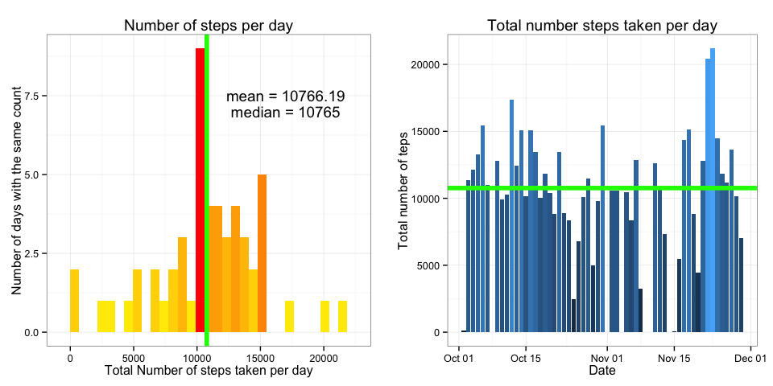
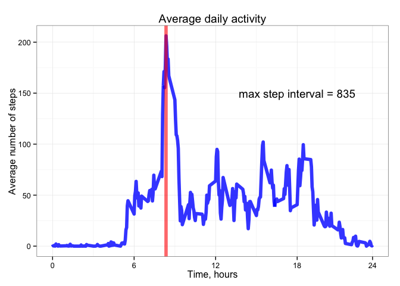
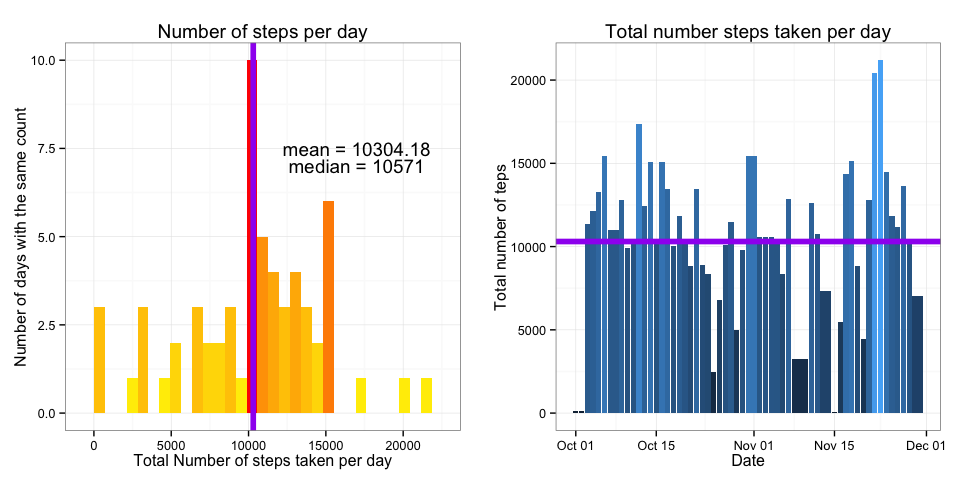

# Reproducible Research: Peer Assessment 1


## Loading and preprocessing the data

Load the data  

```r
activity <- read.csv("activity.csv", stringsAsFactors = FALSE)
str(activity)
```

```
## 'data.frame':	17568 obs. of  3 variables:
##  $ steps   : int  NA NA NA NA NA NA NA NA NA NA ...
##  $ date    : chr  "2012-10-01" "2012-10-01" "2012-10-01" "2012-10-01" ...
##  $ interval: int  0 5 10 15 20 25 30 35 40 45 ...
```

Process/transform the data (if necessary) into a format suitable for your analysis

```r
activity_summary <- activity %>%
                    group_by(date) %>% 
                    summarise("total"  = sum(steps), 
                              "mean"   = mean(steps), 
                              "median" = median(steps), 
                              "nas"    = sum(is.na(steps)))
head(activity_summary)
```

```
## Source: local data frame [6 x 5]
## 
##         date total     mean median nas
## 1 2012-10-01    NA       NA     NA 288
## 2 2012-10-02   126  0.43750      0   0
## 3 2012-10-03 11352 39.41667      0   0
## 4 2012-10-04 12116 42.06944      0   0
## 5 2012-10-05 13294 46.15972      0   0
## 6 2012-10-06 15420 53.54167      0   0
```

## What is mean total number of steps taken per day?

Make a histogram of the total number of steps taken each day   
 

Calculate and report the mean and median total number of steps taken per day   

```r
mean(activity_summary$total, na.rm=TRUE)
```

```
## [1] 10766.19
```

```r
median(activity_summary$total, na.rm=TRUE)
```

```
## [1] 10765
```


## What is the average daily activity pattern?

Time series plot of the 5-minute interval (x-axis) and the average number of steps taken, averaged across all days (y-axis)

```r
activity_daily <- activity %>%
                 group_by(interval) %>%
                 summarise("steps_ave" = mean(steps, na.rm=T))
 
# activity_daily$interval <- sprintf("%04d", activity_daily$interval)
# activity_daily$daytime  <- parse_date_time(activity_daily$interval, "HM")
# activity_daily$interval <- as.numeric(activity_daily$interval)
```



The following 5-minute interval, on average across all the days in the dataset, contains the maximum number of steps:


```r
activity_daily$interval[which.max(activity_daily$steps_ave)]
```

```
## [1] 835
```
Which correspnds to 8:35 in the morning.

## Imputing missing values

Total number of missing values in the data set is 2304. Total number of 5 minute intervals per da is 288. From activty summary statistics we determien that we are missing data for 8 days.

For days that are missing values we will use the prevous day as the imputed value except for teh day one where day 2 values will be used:


```r
act_imputed <- activity
act_imputed$date <- as.factor(act_imputed$date)
act_list <- split(act_imputed, act_imputed$date)

na_days <- which(activity_summary$nas == 24*60/5)
nmax <- length(act_list)

for(i in na_days) {
    if(i == 1) {
        act_list[[i]]$steps <- act_list[[i+1]]$steps
    } else {
        act_list[[i]]$steps <- act_list[[i-1]]$steps
    }
}

act_imputed <- unsplit(act_list, act_imputed$date)
act_imputed$date <- as.Date(act_imputed$date)

act_imp_sum <- act_imputed %>%
               group_by(date) %>% summarise("total"  = sum(steps),
                                            "nas"    = sum(is.na(steps)))
```

Let's look at the histogram of the daily total number of steps for the new dataset with imputed values:
 

Calculate and report the mean and median total number of steps taken per day  for the data set with imputed values.

```r
mean(act_imp_sum$total)
```

```
## [1] 10304.18
```

```r
median(act_imp_sum$total)
```

```
## [1] 10571
```
The new values for mean and median are lower for the imputed data set than mean and mediam for the original data set with missing values.

## Are there differences in activity patterns between weekdays and weekends?


```r
act_imputed$daytype <- "weekday"
act_imputed$daytype[weekdays(act_imputed$date) %in% c("Saturday", "Sunday")] <- "weekend"
act_imputed$daytype <- as.factor(act_imputed$daytype)

act_wkd <- act_imputed %>% 
           group_by(daytype, interval) %>%
           summarize(steps_ave = mean(steps))

str(act_wkd)
```

```
## Classes 'grouped_df', 'tbl_df', 'tbl' and 'data.frame':	576 obs. of  3 variables:
##  $ daytype  : Factor w/ 2 levels "weekday","weekend": 1 1 1 1 1 1 1 1 1 1 ...
##  $ interval : int  0 5 10 15 20 25 30 35 40 45 ...
##  $ steps_ave: num  2.0222 0.4 0.1556 0.1778 0.0889 ...
##  - attr(*, "vars")=List of 1
##   ..$ : symbol daytype
##  - attr(*, "drop")= logi TRUE
```


